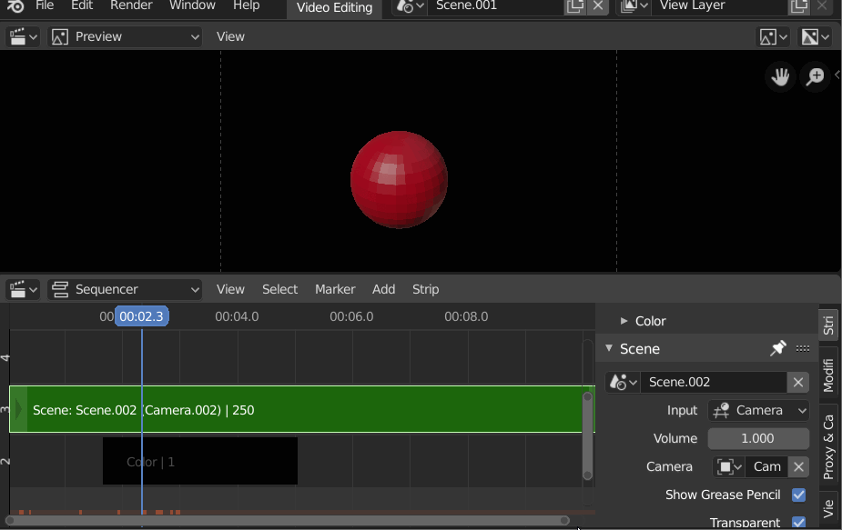

# change_to_scene_from_scene-strip
Changes to the scene from the active scene strip.

Location: Sequencer Sidebar Scene Strip Properties, Add Menu and Context Menu

Hotkey: Shift + Tab for toggle jump to/return from the scene strip refrenced scene. 

Additional functions from Previz Camera Tools have been added: 
- Lock 3D View to Sequencer - which makes the sequencer control camera switching in current scene.
- Add Camera to Sequencer - which adds selected camera as a scene strip to the sequencer.
- Convert 'Bind Camera to Markers' to scene strips in the sequencer. 
